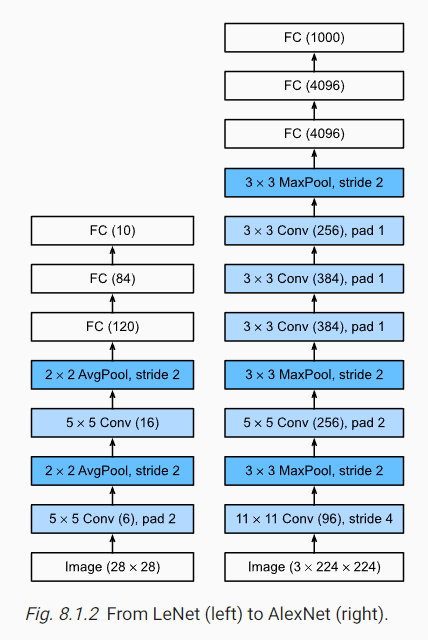
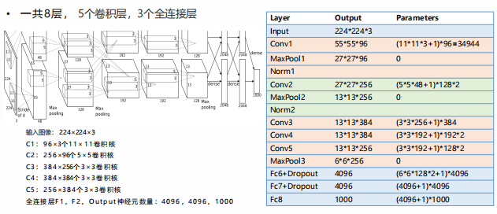
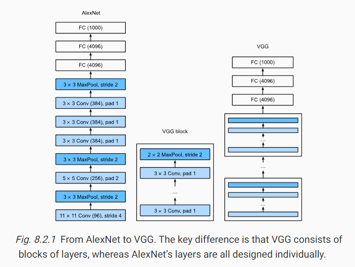
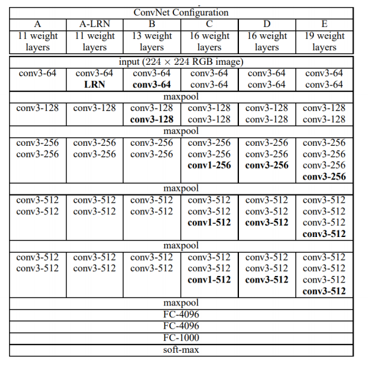
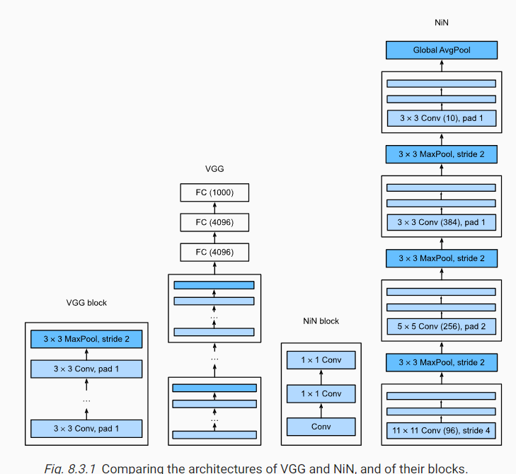
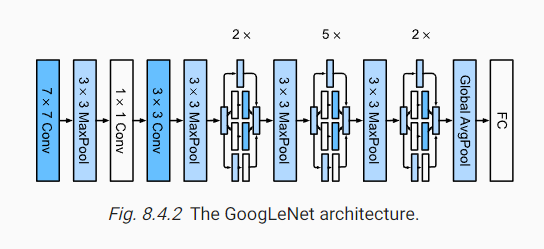
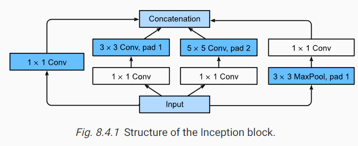
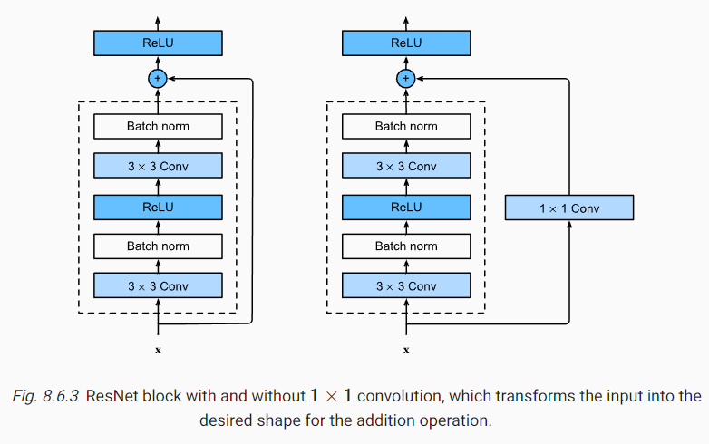
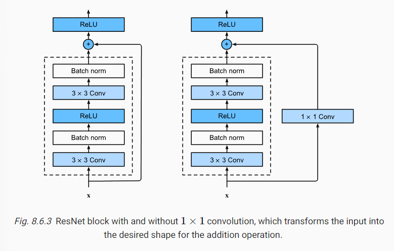
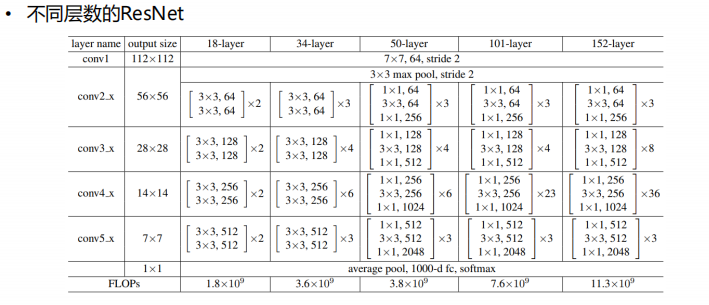

## AlexNet (2012)

- several conv+pooling, ReLU, Dropout, overlapping, Data Augmentation, two GPUs
- go deeper than LeNet, launch a Deep Learning Boom

## VGG (2014)

- using conv_blocks
- smaller conv kernals(3*3) are useful
- go deeper

## NiN (2013)

#### 1*1 conv
- nonlinearity across channels (feature recombination)
- aids the quest for fewer parameters

#### global average pooling
- replace giant fully connected layers, fewer parameters 

## GoogLenNet (2014)

#### Inception Module: concatenate multi-branch, parallel conv_kernel
-  “we need to go deeper”

## ResNet (2015 Kaiming He)

- solve the problem of gradient vanishing and degradation in deep networks
- make it possible to train ultra-deep networks (At least it doesn't make the model worse) 

